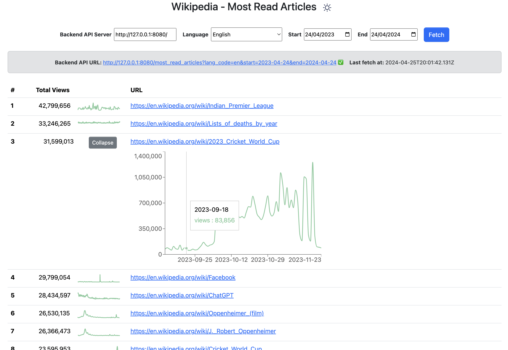
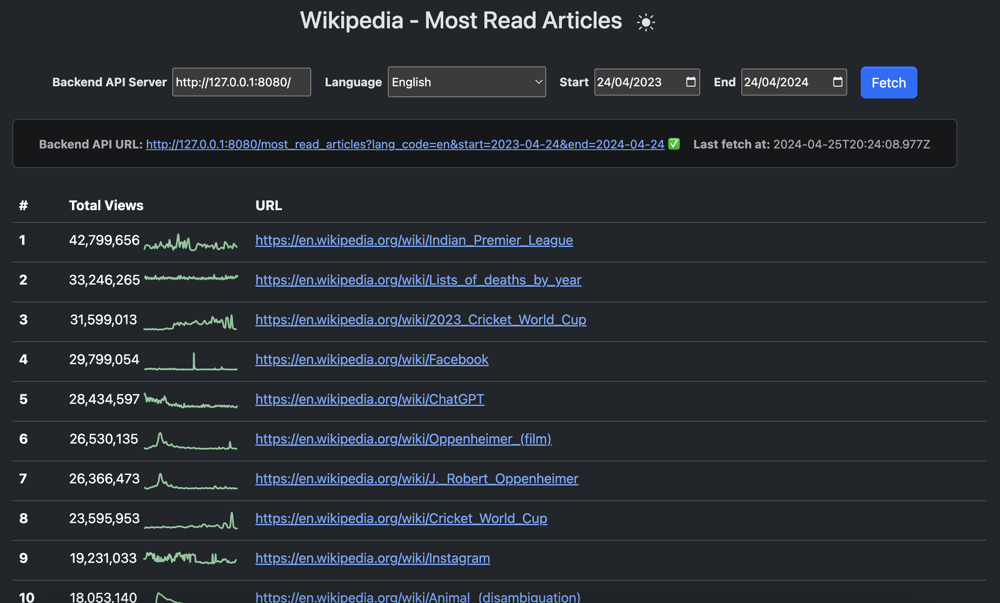

# wikipedia-mostread

## Overview

This project utilizes Wikimedia's Feed API, specifically the [Featured Content endpoint](https://api.wikimedia.org/wiki/Feed_API/Reference/Featured_content), to retrieve and aggregate **Wikipedia's most-read articles** within a user-defined date range.


## Project Structure

```
├── backend
│   │── app  (Python Flask app)
│   │── shared  (Wiki API + AsyncIO rate limiter modules)
│   └── tests (Unit and integration tests)
│
└── frontend
    └── ...  (React + TypeScript + Vite app)
```


## Installation

### Backend
```sh
# Prepare Python environment
cd backend/
python3.12 -m venv .venv
source .venv/bin/activate
pip install -r requirements.txt

# Prepare SQLite database
python seed_db.py

# Run the app dev server
python start_server.py

# Try on http://127.0.0.1:8080
```

### Frontend
```sh
cd frontend/
npm install

# Run the Vite dev server
npm run dev

# Try on http://localhost:5173/
```

#### Libraries and Dependencies

##### Backend
- [Python](https://www.python.org/) - Version 3.11 or newer
- [Flask](https://flask.palletsprojects.com/en/3.0.x/) - Server web framework
- [Flask CORS](https://flask-cors.readthedocs.io/en/latest/) - Enables cross-origin AJAX between dev servers
- [Flask SQLAlchemy](https://flask-sqlalchemy.palletsprojects.com/en/3.1.x/) - Database ORM
- [HTTPX](https://www.python-httpx.org/) - HTTP/2 client

##### Frontend
- [NPM](https://www.npmjs.com/) - JavaScript package manager
- [Vite](https://vitejs.dev/guide/) - React + TypeScript build tool
- [React Bootstrap](https://react-bootstrap.netlify.app/) - [Bootstrap](https://getbootstrap.com/) components
- [Recharts](https://recharts.org/) - Charting library built on React components

## Usage

Once you have the **backend server running** (installation instructions above) you can call the following endpoint to get Wikipedia's most read articles by date range, for example:

http://127.0.0.1:8080/most_read_articles?lang_code=en&start=2024-02-28&end=2024-02-28

**Parameters:**
- **`lang_code` (Language code):** For example, `en` (English) or `es` (Spanish). [List of supported languages](https://wikistats.wmcloud.org/display.php?t=wp).
- **`start` (Start date):** YYYY-MM-DD formatted date, for example, `2024-02-28`.
- **`end` (End date):** Formatted end date (inclusive) of the date range.

**Example output:**
```json
{
  "data": [
    {
      "page": "https://en.wikipedia.org/wiki/Richard_Lewis_(comedian)",
      "pageid": 217483,
      "total_views": 378040,
      "view_history": [
        {
          "date": "2024-02-28",
          "views": 378040
        }
      ]
    },

  ],
  "errors": []
}
```


## Implementation Details

#### Backend

The backend app uses AsyncIO and HTTP/2 to query Wikimedia's API server concurrently. It limits the number of active queries to a maximum of 100 per second.

An additional local caching layer was implemented in SQLite. The cached responses are stored as zlib compressed BLOBs to reduce the database file size.

Upon examining the daily responses from the English Wikipedia's Feed API over the past year, we found that the Featured Content text responses averaged 250 KB in size. However, after applying zlib compression and storing them as BLOBs, their average size reduced significantly to 50 KB. This compression method effectively shrinks our SQLite database size by 80%.

Note that future cache reduction could be achieved by selectively storing specific properties relevant to the application's needs, instead of simply storing the entire API response.

#### Frontend

At the moment the frontend app is a simple user-friendly interface to our backend app. In the future, I might experiment querying directly Wikimedia API bypassing our backend app aggregation and caching.






## Troubleshooting

#### Rate Limits
A 429 HTTP response status code from the Feed API indicates that the applicable rate limit has been exceeded. [Rate limits of Wikimedia API](https://api.wikimedia.org/wiki/Rate_limits).

You can optionally initialize the [WikiAPI client](https://github.com/gofordiego/wikipedia-mostread/blob/main/backend/shared/wiki_api.py) with an access token to increase the rate limit. [Authentication for Wikimedia API](https://api.wikimedia.org/wiki/Authentication).
